# Codeit Resources

<div  align="center">
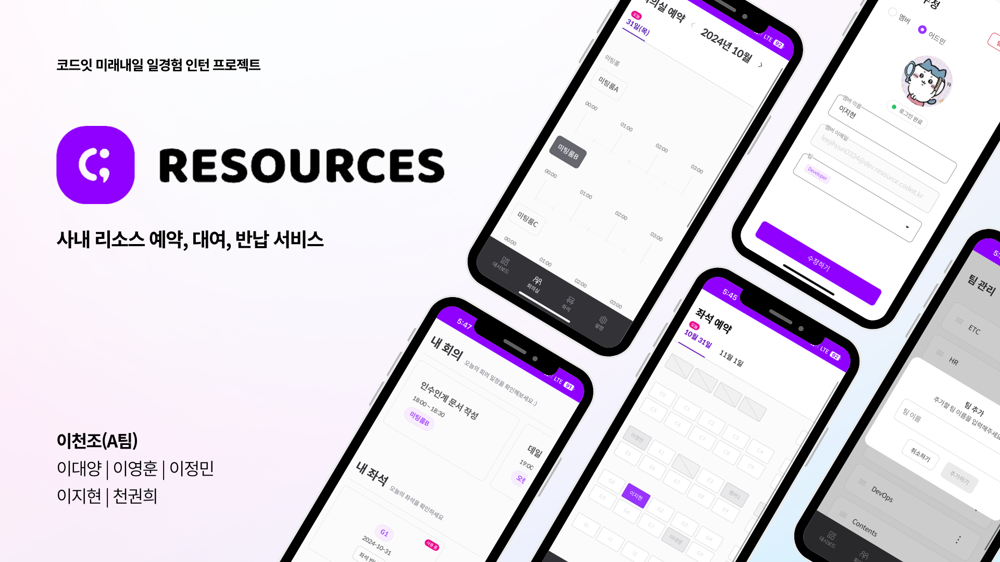
</div>

코드잇 미래내일 일경험 인턴에서 진행한 프로젝트입니다.

<br/>

# 💡 주요 업데이트 내용 (2.0)

> 이전 버전([Codeit Resources 1.0](https://github.com/codeit-2000/codeit-resources))에서 다음과 같은 개선사항이 추가되었습니다.

### 1. Google Calendar 연동

회의실 예약 시 자동으로 Google Calendar에 일정이 추가되도록 기능을 구현하였습니다.
<br/>사용자는 예약된 일정을 Google Calendar에서도 쉽게 확인할 수 있으며, 수정 및 삭제 사항도 실시간으로 반영됩니다.

### 2. Next.js 마이그레이션

Google Calendar API 연동을 위한 API Routes 기능을 활용하기 위해 React에서 Next.js로 마이그레이션하였습니다.

### 3.NextAuth.js 구글 로그인 구현

기존 AWS Cognito 인증 방식을 대체하여 NextAuth.js를 활용한 Google 로그인을 도입하였습니다.

### 4. 서버 로직 구현

기존에 클라이언트에서 처리하던 정렬 로직을 Next.js API Routes를 활용하여 서버에서 처리하도록 리팩토링하여 초기 렌더링 속도를 개선하였습니다.

### 5. UI 개선

사용자 경험을 강화하기 위해 일부 페이지와 컴포넌트의 UI를 개선하였습니다.

### 6. 버그 수정

이전 버전에서 보고된 다양한 버그를 수정하여 시스템의 안정성과 신뢰성을 높였습니다.

<br/>

# 📝 프로젝트 개요

**프로젝트 명:** Codeit Resources

**프로젝트 설명:** 회사의 리소스(회의실 및 좌석) 예약 대여 반납 시스템

**프로젝트 기간:** 2024.10.07 ~ 2024.11.18

**배포 주소:** https://resource.codeit.kr

**발표 자료:** [이천조(A팀) 프로젝트 발표 자료](https://www.canva.com/design/DAGU9REKjyE/EzsBM3kU3aBkLQCEiB8fZg/view?utm_content=DAGU9REKjyE&utm_campaign=designshare&utm_medium=link&utm_source=editor)

<br/>

## 👏 팀원

<table align="center">
    <tbody>
        <tr>
            <td>
                <a href="https://github.com/oceanlee-seoul">
                    
                </a>
            </td>
            <td>
                <a href="https://github.com/tkddbs587">
                    
                </a>
            </td>
            <td>
                <a href="https://github.com/oris8">
                    
                </a>  
            </td>
                        <td>
                <a href="https://github.com/easyhyun00">
                    
                </a>  
            </td>
            <td>
                <a href="https://github.com/alexgoni">
                    
                </a>
            </td>
        </tr>
        <tr>
            <th>
                <a href="https://github.com/oceanlee-seoul">이대양</a>
            </th>
            <th>
                <a href="https://github.com/tkddbs587">이영훈</a>
            </th>
            <th>
                <a href="https://github.com/oris8">이정민</a>
            </th>
            <th>
                <a href="https://github.com/easyhyun00">이지현</a>
            </th>
            <th>
                <a href="https://github.com/alexgoni">천권희</a>
            </th>
        </tr>
        <tr>
            <th>
                FrontEnd
            </th>
            <th>
                FrontEnd
            </th>
            <th>
                FullStack
            </th>
            <th>
                FullStack
            </th>
            <th>
                FullStack, PM
            </th>
        </tr>
    </tbody>
</table>

<br/>

# 🛠️ 기술 스택

## BackEnd

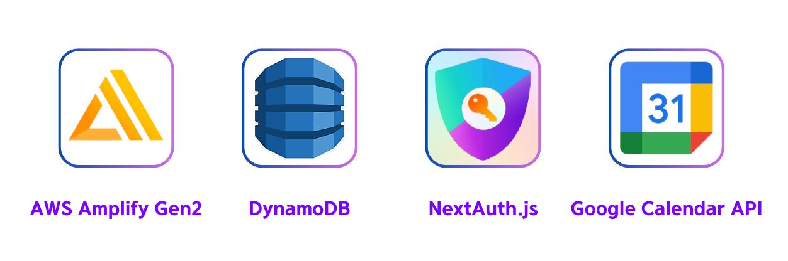

## FrontEnd


## ETC

<div  align="center">
   
<br>
 
</div>

<br/>

# 🗂️ 디렉토리 구조

```
📦 Root
┣ 📂 .github                # GitHub 설정 파일 및 워크플로
┣ 📂 .husky                 # Git Hooks 설정 폴더
┣ 📂 amplify                # AWS Amplify 관련 파일 및 설정
┣ 📂 public                 # 정적 파일 (이미지, svg 등)
┣ 📂 src                    # 소스 코드 메인 디렉토리
┃ ┣ 📂 components           # 재사용 가능한 React 컴포넌트
┃ ┣ 📂 constants            # 상수 값 정의
┃ ┣ 📂 hooks                # 커스텀 React 훅
┃ ┣ 📂 lib                  # 유틸리티 라이브러리 폴더
┃ ┃ ┣ 📂 api                # API 관련 함수
┃ ┃ ┣ 📂 types              # TypeScript 타입 정의
┃ ┃ ┣ 📂 utils              # 유틸리티 함수
┃ ┃ ┗ 📂 zod-schema         # Zod 유효성 검사 스키마
┃ ┣ 📂 pages                # Next.js 페이지 라우터
┃ ┃ ┗ 📂 api                # API Routes
┃ ┣ 📂 store                # 상태 관리 스토어
┃ ┗ 📜 middleware.ts        # Next.js 미들웨어
┣ 📜 .eslintrc.json         # ESLint 설정
┣ 📜 .prettierrc.json       # Prettier 설정
┣ 📜 amplify.yml            # AWS Amplify 설정 파일 (배포 및 빌드 설정)
┗ 📜 package.json           # 프로젝트 종속성 정의
```

## 로컬 실행 커맨드

```bash
pnpm install # 패키지 설치

pnpm run dev # 웹 실행
pnpm run storybook  # 스토리북 실행
```

<br/>

# ✨ 핵심 기능

## 1. 회의실 예약 - Google Calendar 연동

타임라인에서 회의 일정을 입력하여 회의실을 예약할 수 있으며, 예약 일정이 겹치는 경우 회의실을 예약할 수 없습니다.
<br/>
참여중인 예약을 수정하거나 취소할 수 있습니다.
<br/>
예약 내역은 Google Calendar에서 확인 가능하며, Google Calendar에서 예약한 내역도 확인 가능합니다.

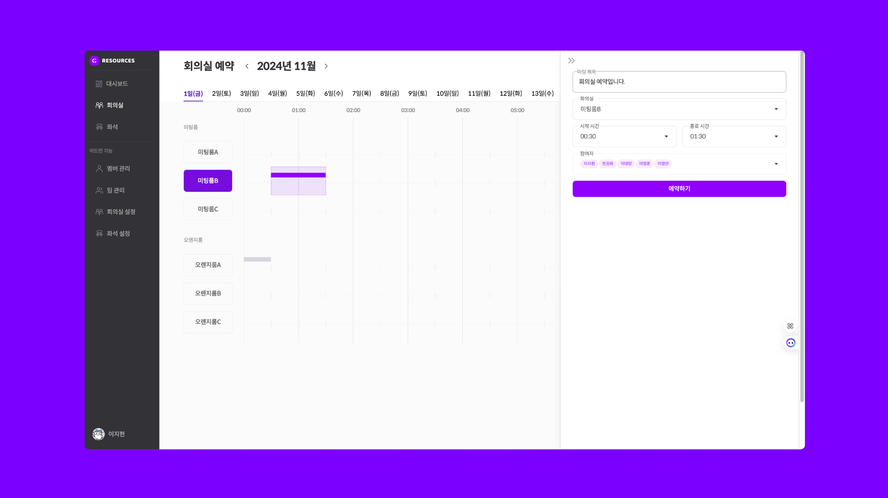

## 2. 좌석 예약

오늘을 기점으로, 내일까지 좌석을 예약할 수 있습니다.
<br/>
좌석 이동과 좌석 반납도 가능합니다.

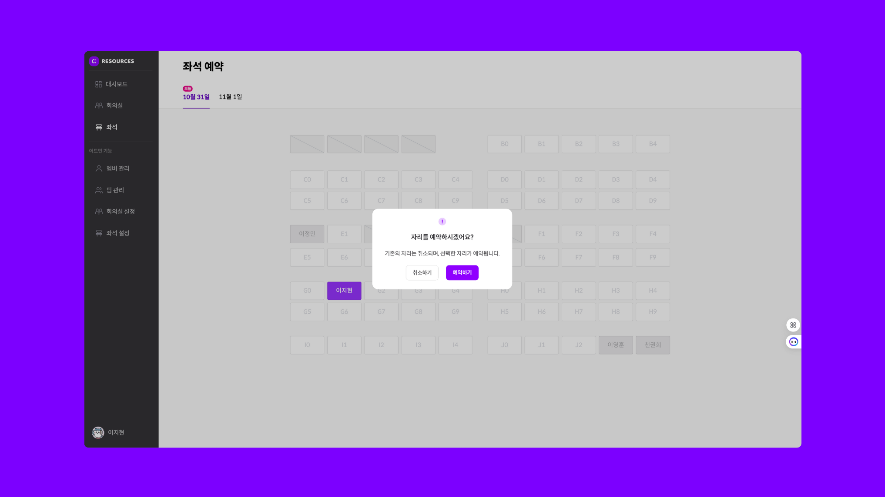

## 3. 대시보드

오늘 예약된 회의실 일정을 확인하고 예약된 좌석을 확인할 수 있습니다.
<br/>
예약된 회의를 종료할 수 있고, 좌석을 반납할 수도 있습니다.

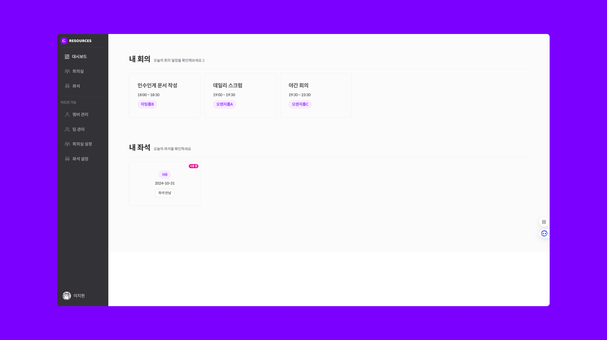

## 4. 내 프로필

내 프로필를 확인할 수 있습니다.

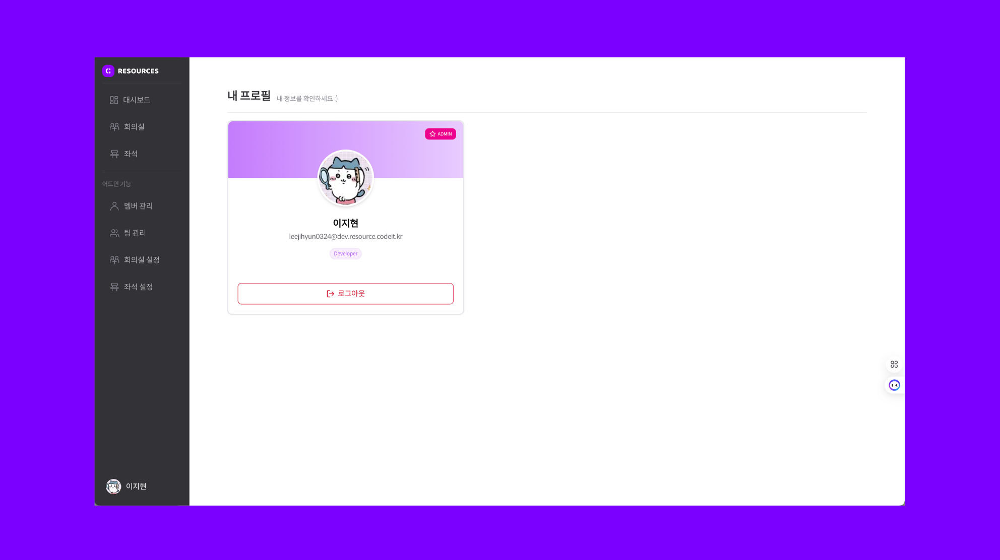

## 5. 팀 관리 - ADMIN 기능

관리자가 팀을 추가하고, 수정하고, 삭제할 수 있습니다.
<br/>
팀 삭제 시, 삭제할 팀의 이름을 입력받아 실수를 방지하였습니다.

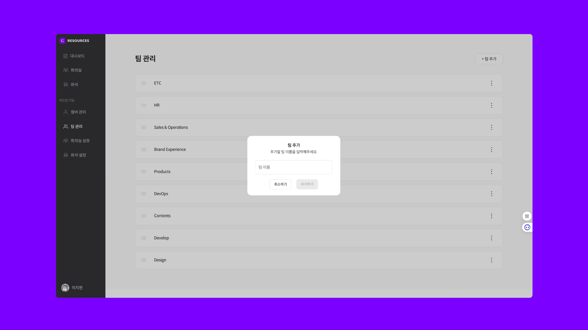

## 6. 멤버 관리 - ADMIN 기능

관리자가 멤버의 역할, 이름, 이메일, 팀을 설정하여 추가할 수 있습니다.
<br/>
멤버 수정, 탈퇴 또한 가능합니다.

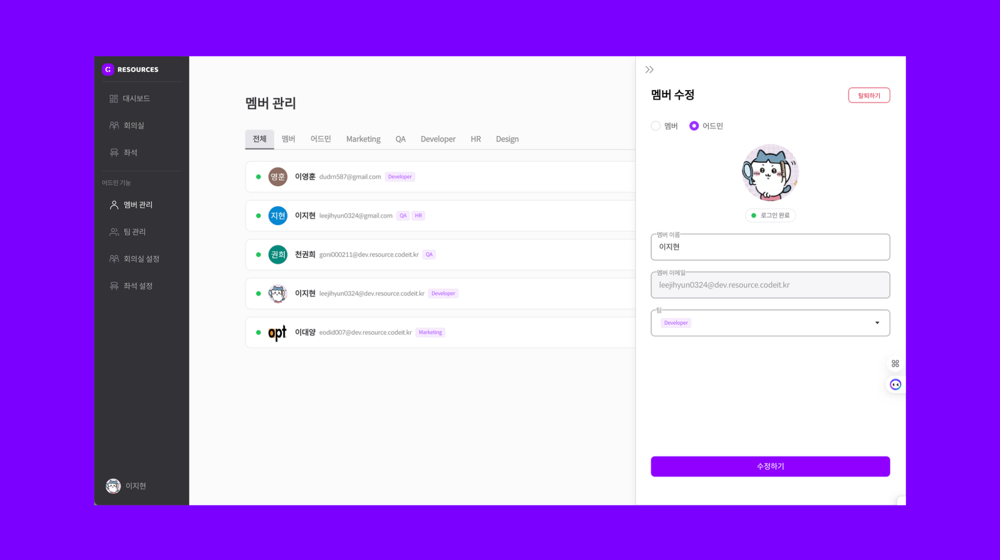

## 7. 회의실 설정 - ADMIN 기능

관리자가 Google Calendar 리소스와 연동하여 회의실의 대분류와 소분류를 추가할 수 있습니다.

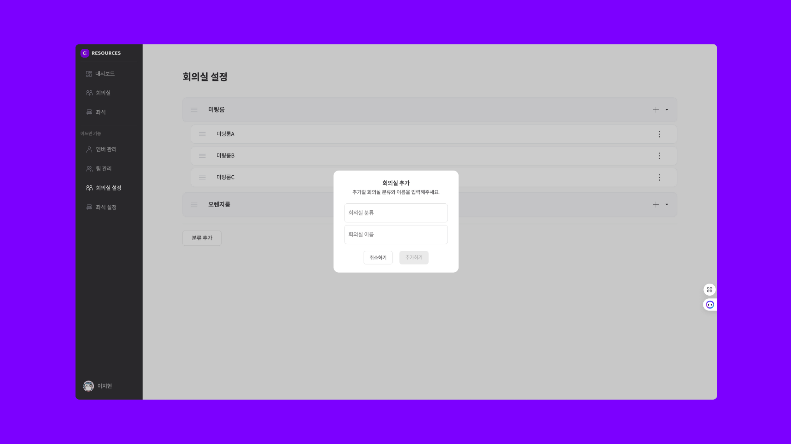

## 8. 좌석 설정 - ADMIN 기능

관리자가 좌석의 고정 좌석을 설정하거나 사용 불가능한 좌석을 설정할 수 있습니다.

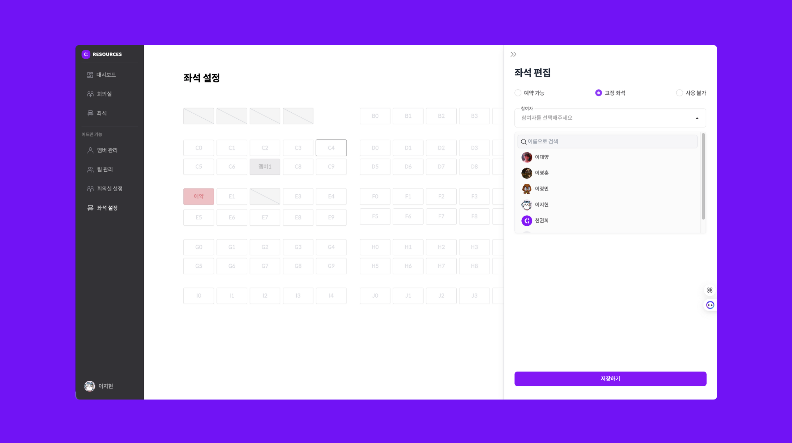

## 9. 로그인

사내 구글 워크스페이스 계정만으로 로그인할 수 있도록 제한하였습니다.

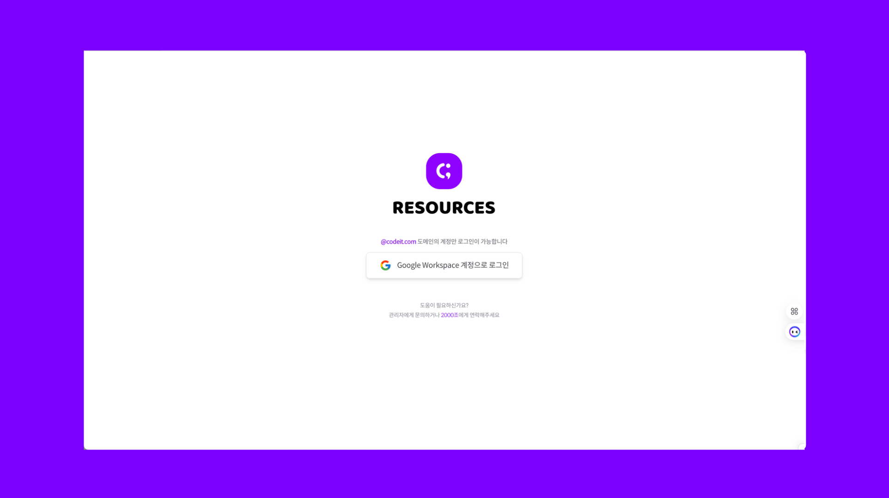

## 10. 모바일 반응형

모바일 환경에서도 원활히 사용할 수 있도록 반응형 디자인을 적용하였습니다.

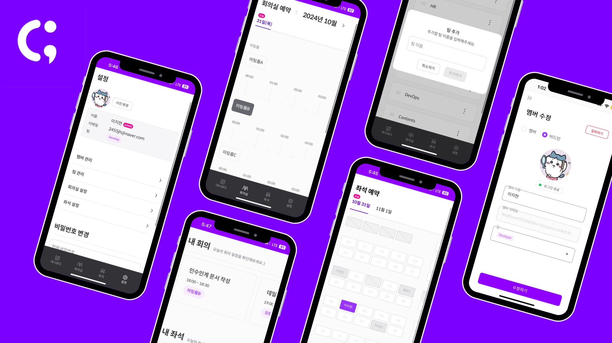
